# BFF 집계 후보 화면 상세 분석

## 1. 목적
프론트엔드 화면에서 다수의 API 호출이 발생하는 지점을 식별하고,
BFF에서 데이터 집계(aggregation)로 개선 가능한 후보를 도출한다.

## 2. 분석 방법
### 2.1 정적 분석(코드 기반)
- 화면 단위 확인: `src/app/**/page.tsx`
- 각 화면이 사용하는 위젯 추적
- 위젯 내부 API 호출(`getUserMe`, `getChatList` 등) 확인
- 복수 API 호출이 존재하는 화면을 집계 후보로 분류

### 2.2 근거 수집 방식
- `rg`로 API 사용 위치 탐색
- 핵심 위젯 파일 직접 확인

### 2.3 AST 방법(타입/의존성 그래프 기반)
- TypeScript AST를 사용해 import/export 관계를 추적
- “페이지 → 위젯 → API 호출” 매핑을 자동 생성
- 결과는 테이블(CSV/Markdown)과 Mermaid 그래프로 출력

출력 파일:
- `docs/bff/bff-aggregation-analysis.md`
- `docs/bff/bff-aggregation-analysis.csv`
- `docs/bff/bff-aggregation-graph.mmd`

## 3. 집계 후보 화면 요약
| 화면 | 위젯 | 현재 호출 API | 호출 수 | 집계 가치 |
|---|---|---|---:|---|
| `/onboarding/profile` | `OnboardingProfileForm` | `getSkills`, `getJobs`, `getCareerLevels` | 3 | 높음 |
| `/me/edit` | `MyPageEdit` | `getUserMe`, `getJobs`, `getCareerLevels`, `getSkills` | 4 | 매우 높음 |
| `/chat` | `ChatList` | `getUserMe`, `getChatList` | 2 | 중간 |
| `/experts/[id]` | `ExpertDetailPage` | `getExpertDetail`, `getResumes` | 2 | 중간 |
| `/chat/[chatId]` | `ChatRoom` + `useChatHistory` | `getChatDetail`, `getChatMessages` | 2 | 중간 |
| `/chat/[chatId]/detail` | `ChatDetail` | `getChatDetail` + `getResumeDetail` | 2 | 중간 |

## 4. 상세 분석

### 4.1 /onboarding/profile
- 위젯: `src/widgets/onboarding/ui/OnboardingProfileForm.tsx`
- 동시에 호출되는 API:
  - `getSkills()`
  - `getJobs()`
  - `getCareerLevels()`
- 집계 제안:
  - `GET /bff/onboarding/metadata` → `{ skills, jobs, career_levels }`
- 기대 효과:
  - 초기 로딩 요청 3건 → 1건

### 4.2 /me/edit
- 위젯: `src/widgets/my-page-edit/ui/MyPageEdit.tsx`
- 동시에 호출되는 API:
  - `getUserMe()`
  - `getJobs()`
  - `getCareerLevels()`
  - `getSkills()`
- 집계 제안:
  - `GET /bff/me/edit-bootstrap` → `{ user, jobs, career_levels, skills }`
- 기대 효과:
  - 초기 로딩 요청 4건 → 1건

### 4.3 /chat
- 위젯: `src/widgets/chat-list/ui/ChatList.tsx`
- 동시에 호출되는 API:
  - `getUserMe()`
  - `getChatList()`
- 집계 제안:
  - `GET /bff/chat/list` → `{ currentUser, chats }`
- 기대 효과:
  - 유저 정보 + 채팅 리스트 동시 제공

### 4.4 /experts/[id]
- 위젯: `src/widgets/expert-detail/ui/ExpertDetailPage.tsx`
- 동시에 호출되는 API:
  - `getExpertDetail(userId)`
  - `getResumes()` (로그인 시)
- 집계 제안:
  - `GET /bff/experts/:id/detail` → `{ expert, resumes }`
- 기대 효과:
  - 전문가 상세 + 내 이력서 목록 한번에 제공

### 4.5 /chat/[chatId]
- 위젯: `src/widgets/chat-room/ui/ChatRoom.tsx`
- 관련 훅: `src/features/chat/model/useChatHistory.client.ts`
- 동시에 호출되는 API:
  - `getChatDetail({ chatId })`
  - `getChatMessages({ chatId })`
- 집계 제안:
  - `GET /bff/chat/:id/room` → `{ detail, messages }`
- 기대 효과:
  - 채팅방 초기 진입 요청 통합

### 4.6 /chat/[chatId]/detail
- 위젯: `src/widgets/chat-detail/ui/ChatDetail.tsx`
- 동시에 호출되는 API:
  - `getChatDetail(chatId)` (페이지에서 전달된 detail 기반)
  - `getResumeDetail(detail.resume_id)`
- 집계 제안:
  - `GET /bff/chat/:id/detail` → `{ detail, resume }`
- 기대 효과:
  - 채팅 상세 + 첨부 이력서 데이터 병합

## 5. 결론
현재 구조는 BFF가 1:1 프록시 역할만 수행 중이며,
데이터 집계는 프론트에서 직접 조합하는 방식이다.

우선순위 기준(요청 수/초기 로딩 부담)을 고려할 때,
`/me/edit`와 `/onboarding/profile`이 집계 우선 적용 후보로 적합하다.

## 6. AST 분석 결과(자동 추출)
아래 표는 `docs/bff/bff-aggregation-analysis.md`의 내용을 병합한 것이다.

| Page | Widgets | API Calls | Count |
|---|---|---:|---:|
| / | Footer, Header, SearchBar, SplashGate, HomeGuardToast, RecruitmentLinksTicker, SignupConfetti, TechBlogBanner, TechBlogTicker | - | 0 |
| /chat | ChatList, Footer | getChatList, getUserMe | 2 |
| /chat/[chatId] | - | - | 0 |
| /chat/[chatId]/detail | - | - | 0 |
| /experts | ExpertSearchPage | getExperts | 1 |
| /experts/[id] | ExpertDetailPage | createChat, getChatList, getExpertDetail, getMe, getResumes | 5 |
| /me | MyPage | getUserMe | 1 |
| /me/edit | MyPageEdit | checkNickname, createPresignedUrl, getCareerLevels, getJobs, getSkills, getUserMe, updateUserMe, uploadToPresignedUrl | 8 |
| /me/verify | MyPageVerify | sendEmailVerification, verifyEmailVerification | 2 |
| /oauth/kakao/callback | KakaoCallbackClient | kakaoLogin | 1 |
| /onboarding | OnboardingRoleSelect | - | 0 |
| /onboarding/profile | OnboardingProfileForm | checkNickname, getCareerLevels, getJobs, getSkills, sendEmailVerification, signup, verifyEmailVerification | 7 |
| /report | Footer, Header | - | 0 |
| /resume | ResumePage | deleteResume, getResumes | 2 |
| /resume/[resumeId] | ResumeDetailPage | getResumeDetail | 1 |
| /resume/edit | ResumeEditPage | createPresignedUrl, createResume, getResumeDetail, parseResumeSync, updateResume, uploadToPresignedUrl | 6 |

### 6.1 AST 그래프(Mermaid)

```mermaid
graph TD
  page__["/"]
  widget_Footer_page__["src/widgets/footer/ui/Footer.tsx"]
  page__ --> widget_Footer_page__
  widget_Header_page__["src/widgets/header/ui/Header.tsx"]
  page__ --> widget_Header_page__
  widget_SearchBar_page__["src/widgets/search-bar/ui/SearchBar.tsx"]
  page__ --> widget_SearchBar_page__
  widget_SplashGate_page__["src/widgets/splash-screen/ui/SplashGate.tsx"]
  page__ --> widget_SplashGate_page__
  widget_HomeGuardToast_page__["src/widgets/home/ui/HomeGuardToast.tsx"]
  page__ --> widget_HomeGuardToast_page__
  widget_RecruitmentLinksTicker_page__["src/widgets/home/ui/RecruitmentLinksTicker.tsx"]
  page__ --> widget_RecruitmentLinksTicker_page__
  widget_SignupConfetti_page__["src/widgets/home/ui/SignupConfetti.tsx"]
  page__ --> widget_SignupConfetti_page__
  widget_TechBlogBanner_page__["src/widgets/home/ui/TechBlogTicker.tsx"]
  page__ --> widget_TechBlogBanner_page__
  widget_TechBlogTicker_page__["src/widgets/home/ui/TechBlogTicker.tsx"]
  page__ --> widget_TechBlogTicker_page__
  page__chat["/chat"]
  widget_ChatList_page__chat["src/widgets/chat-list/ui/ChatList.tsx"]
  page__chat --> widget_ChatList_page__chat
  api_getChatList["getChatList()"]
  widget_ChatList_page__chat --> api_getChatList
  api_getUserMe["getUserMe()"]
  widget_ChatList_page__chat --> api_getUserMe
  widget_Footer_page__chat["src/widgets/footer/ui/Footer.tsx"]
  page__chat --> widget_Footer_page__chat
  api_getChatList["getChatList()"]
  api_getUserMe["getUserMe()"]
  page__chat__chatId_["/chat/[chatId]"]
  page__chat__chatId__detail["/chat/[chatId]/detail"]
  page__experts["/experts"]
  widget_ExpertSearchPage_page__experts["src/widgets/expert-search/ui/ExpertSearchPage.tsx"]
  page__experts --> widget_ExpertSearchPage_page__experts
  api_getExperts["getExperts()"]
  widget_ExpertSearchPage_page__experts --> api_getExperts
  api_getExperts["getExperts()"]
  page__experts__id_["/experts/[id]"]
  widget_ExpertDetailPage_page__experts__id_["src/widgets/expert-detail/ui/ExpertDetailPage.tsx"]
  page__experts__id_ --> widget_ExpertDetailPage_page__experts__id_
  api_createChat["createChat()"]
  widget_ExpertDetailPage_page__experts__id_ --> api_createChat
  api_getChatList["getChatList()"]
  widget_ExpertDetailPage_page__experts__id_ --> api_getChatList
  api_getExpertDetail["getExpertDetail()"]
  widget_ExpertDetailPage_page__experts__id_ --> api_getExpertDetail
  api_getMe["getMe()"]
  widget_ExpertDetailPage_page__experts__id_ --> api_getMe
  api_getResumes["getResumes()"]
  widget_ExpertDetailPage_page__experts__id_ --> api_getResumes
  api_createChat["createChat()"]
  api_getChatList["getChatList()"]
  api_getExpertDetail["getExpertDetail()"]
  api_getMe["getMe()"]
  api_getResumes["getResumes()"]
  page__me["/me"]
  widget_MyPage_page__me["src/widgets/my-page/ui/MyPage.tsx"]
  page__me --> widget_MyPage_page__me
  api_getUserMe["getUserMe()"]
  widget_MyPage_page__me --> api_getUserMe
  api_getUserMe["getUserMe()"]
  page__me_edit["/me/edit"]
  widget_MyPageEdit_page__me_edit["src/widgets/my-page-edit/ui/MyPageEdit.tsx"]
  page__me_edit --> widget_MyPageEdit_page__me_edit
  api_checkNickname["checkNickname()"]
  widget_MyPageEdit_page__me_edit --> api_checkNickname
  api_createPresignedUrl["createPresignedUrl()"]
  widget_MyPageEdit_page__me_edit --> api_createPresignedUrl
  api_getCareerLevels["getCareerLevels()"]
  widget_MyPageEdit_page__me_edit --> api_getCareerLevels
  api_getJobs["getJobs()"]
  widget_MyPageEdit_page__me_edit --> api_getJobs
  api_getSkills["getSkills()"]
  widget_MyPageEdit_page__me_edit --> api_getSkills
  api_getUserMe["getUserMe()"]
  widget_MyPageEdit_page__me_edit --> api_getUserMe
  api_updateUserMe["updateUserMe()"]
  widget_MyPageEdit_page__me_edit --> api_updateUserMe
  api_uploadToPresignedUrl["uploadToPresignedUrl()"]
  widget_MyPageEdit_page__me_edit --> api_uploadToPresignedUrl
  api_checkNickname["checkNickname()"]
  api_createPresignedUrl["createPresignedUrl()"]
  api_getCareerLevels["getCareerLevels()"]
  api_getJobs["getJobs()"]
  api_getSkills["getSkills()"]
  api_getUserMe["getUserMe()"]
  api_updateUserMe["updateUserMe()"]
  api_uploadToPresignedUrl["uploadToPresignedUrl()"]
  page__me_verify["/me/verify"]
  widget_MyPageVerify_page__me_verify["src/widgets/my-page-verify/ui/MyPageVerify.tsx"]
  page__me_verify --> widget_MyPageVerify_page__me_verify
  api_sendEmailVerification["sendEmailVerification()"]
  widget_MyPageVerify_page__me_verify --> api_sendEmailVerification
  api_verifyEmailVerification["verifyEmailVerification()"]
  widget_MyPageVerify_page__me_verify --> api_verifyEmailVerification
  api_sendEmailVerification["sendEmailVerification()"]
  api_verifyEmailVerification["verifyEmailVerification()"]
  page__oauth_kakao_callback["/oauth/kakao/callback"]
  widget_KakaoCallbackClient_page__oauth_kakao_callback["src/widgets/auth/ui/KakaoCallbackClient.tsx"]
  page__oauth_kakao_callback --> widget_KakaoCallbackClient_page__oauth_kakao_callback
  api_kakaoLogin["kakaoLogin()"]
  widget_KakaoCallbackClient_page__oauth_kakao_callback --> api_kakaoLogin
  api_kakaoLogin["kakaoLogin()"]
  page__onboarding["/onboarding"]
  widget_OnboardingRoleSelect_page__onboarding["src/widgets/onboarding/ui/OnboardingRoleSelect.tsx"]
  page__onboarding --> widget_OnboardingRoleSelect_page__onboarding
  page__onboarding_profile["/onboarding/profile"]
  widget_OnboardingProfileForm_page__onboarding_profile["src/widgets/onboarding/ui/OnboardingProfileForm.tsx"]
  page__onboarding_profile --> widget_OnboardingProfileForm_page__onboarding_profile
  api_checkNickname["checkNickname()"]
  widget_OnboardingProfileForm_page__onboarding_profile --> api_checkNickname
  api_getCareerLevels["getCareerLevels()"]
  widget_OnboardingProfileForm_page__onboarding_profile --> api_getCareerLevels
  api_getJobs["getJobs()"]
  widget_OnboardingProfileForm_page__onboarding_profile --> api_getJobs
  api_getSkills["getSkills()"]
  widget_OnboardingProfileForm_page__onboarding_profile --> api_getSkills
  api_sendEmailVerification["sendEmailVerification()"]
  widget_OnboardingProfileForm_page__onboarding_profile --> api_sendEmailVerification
  api_signup["signup()"]
  widget_OnboardingProfileForm_page__onboarding_profile --> api_signup
  api_verifyEmailVerification["verifyEmailVerification()"]
  widget_OnboardingProfileForm_page__onboarding_profile --> api_verifyEmailVerification
  api_checkNickname["checkNickname()"]
  api_getCareerLevels["getCareerLevels()"]
  api_getJobs["getJobs()"]
  api_getSkills["getSkills()"]
  api_sendEmailVerification["sendEmailVerification()"]
  api_signup["signup()"]
  api_verifyEmailVerification["verifyEmailVerification()"]
  page__report["/report"]
  widget_Footer_page__report["src/widgets/footer/ui/Footer.tsx"]
  page__report --> widget_Footer_page__report
  widget_Header_page__report["src/widgets/header/ui/Header.tsx"]
  page__report --> widget_Header_page__report
  page__resume["/resume"]
  widget_ResumePage_page__resume["src/widgets/resume/ui/ResumePage.tsx"]
  page__resume --> widget_ResumePage_page__resume
  api_deleteResume["deleteResume()"]
  widget_ResumePage_page__resume --> api_deleteResume
  api_getResumes["getResumes()"]
  widget_ResumePage_page__resume --> api_getResumes
  api_deleteResume["deleteResume()"]
  api_getResumes["getResumes()"]
  page__resume__resumeId_["/resume/[resumeId]"]
  widget_ResumeDetailPage_page__resume__resumeId_["src/widgets/resume-detail/ui/ResumeDetailPage.tsx"]
  page__resume__resumeId_ --> widget_ResumeDetailPage_page__resume__resumeId_
  api_getResumeDetail["getResumeDetail()"]
  widget_ResumeDetailPage_page__resume__resumeId_ --> api_getResumeDetail
  api_getResumeDetail["getResumeDetail()"]
  page__resume_edit["/resume/edit"]
  widget_ResumeEditPage_page__resume_edit["src/widgets/resume-edit/ui/ResumeEditPage.tsx"]
  page__resume_edit --> widget_ResumeEditPage_page__resume_edit
  api_createPresignedUrl["createPresignedUrl()"]
  widget_ResumeEditPage_page__resume_edit --> api_createPresignedUrl
  api_createResume["createResume()"]
  widget_ResumeEditPage_page__resume_edit --> api_createResume
  api_getResumeDetail["getResumeDetail()"]
  widget_ResumeEditPage_page__resume_edit --> api_getResumeDetail
  api_parseResumeSync["parseResumeSync()"]
  widget_ResumeEditPage_page__resume_edit --> api_parseResumeSync
  api_updateResume["updateResume()"]
  widget_ResumeEditPage_page__resume_edit --> api_updateResume
  api_uploadToPresignedUrl["uploadToPresignedUrl()"]
  widget_ResumeEditPage_page__resume_edit --> api_uploadToPresignedUrl
  api_createPresignedUrl["createPresignedUrl()"]
  api_createResume["createResume()"]
  api_getResumeDetail["getResumeDetail()"]
  api_parseResumeSync["parseResumeSync()"]
  api_updateResume["updateResume()"]
  api_uploadToPresignedUrl["uploadToPresignedUrl()"]
```


## 7. 부록: 사용한 탐색 커맨드
```
rg --files -g "page.tsx" src/app
rg -n "getUserMe|getChatList|getResumes|getResumeDetail|getSkills|getJobs|getCareerLevels" src/widgets
sed -n '1,200p' src/widgets/onboarding/ui/OnboardingProfileForm.tsx
sed -n '1,200p' src/widgets/my-page-edit/ui/MyPageEdit.tsx
```
