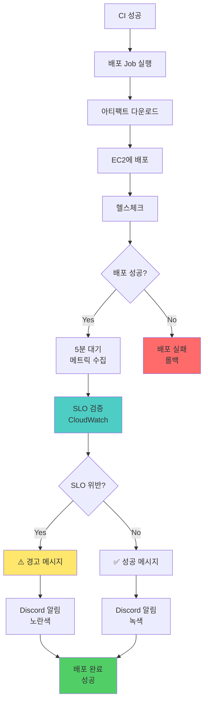

# Frontend SLO 검증 계획

## 개요

CI/CD 파이프라인에 SLI/SLO 기준을 활용한 배포 후 검증 절차를 적용했습니다. 배포 결과가 SLO를 위반하는 경우 경고를 발생시켜 성능 저하를 조기에 감지합니다.

### 주요 개념

- **SLI (Service Level Indicator)**: 서비스 수준을 판단하기 위한 지표 (Core Web Vitals, 렌더링 성능)
- **SLO (Service Level Objective)**: SLI에 대한 목표값
- **Core Web Vitals**: 사용자 경험을 측정하는 Google의 핵심 웹 성능 지표

### 검증 절차

**배포 후 검증**: 배포 직후 실제 사용자 메트릭을 기반으로 성능 저하 여부 확인

---

## 검증 대상 메트릭 및 SLO 목표

프론트엔드 성능을 대표하는 Core Web Vitals 4개와 커스텀 메트릭 4개를 선정하고 각각의 SLO 목표값을 설정했습니다.

### Core Web Vitals

| 메트릭 | 설명 | 평시 SLO (p95) | 피크 SLO (p95) |
|--------|------|---------------|---------------|
| **LCP** (Largest Contentful Paint) | 가장 큰 콘텐츠 요소 렌더링 시간 | < 2.5s | < 4s |
| **FCP** (First Contentful Paint) | 첫 번째 콘텐츠 렌더링 시간 | < 1.8s | < 3s |
| **CLS** (Cumulative Layout Shift) | 레이아웃 이동 누적 점수 | < 0.1 | < 0.1 |
| **INP** (Interaction to Next Paint) | 사용자 상호작용 응답 시간 | < 200ms | < 400ms |

### 커스텀 메트릭

| 메트릭 | 설명 | 평시 SLO (p95) | 피크 SLO (p95) |
|--------|------|---------------|---------------|
| **UploadDuration** | 이력서 파일 업로드 시간 | < 1s | < 2s |
| **RenderTime** | 폼/리스트 렌더링 시간 | < 500ms | < 1s |
| **ChatSendLatency** | 채팅 메시지 전송 지연 | < 100ms | < 200ms |
| **ChatReceiveLatency** | 채팅 메시지 수신 지연 | < 200ms | < 300ms |

**선정 기준**: 사용자 경험에 직접적인 영향, Google의 Core Web Vitals 표준 준수, 주요 기능별 성능 측정 가능성

---

## 배포 후 검증

배포 성공 후 `Verify SLO Compliance (CloudWatch)` step이 실행됩니다. 실제 사용자 메트릭 수집을 위해 5분 대기 후 최근 10분 데이터를 조회합니다.

### 실행 조건

- 배포 성공 후 실행 (`if: success()`)
- 5분 대기 (실제 사용자 트래픽 수집)
- CloudWatch 메트릭 집계 완료 대기

### 검증 시간 범위

- **대기 시간**: 5분 (실제 사용자 메트릭 수집)
- **조회 기간**: 최근 10분
- **집계 단위**: 5분 (300초)

### 계산 과정

1. 각 메트릭별로 CloudWatch에서 평균값 조회
   - Namespace: `ReFit/Frontend`
   - Dimension: `Environment=production`
   - Statistics: `Average` (p95는 CloudWatch ExtendedStatistics로 확장 가능)

2. SLO 목표값과 비교
   - Core Web Vitals: LCP, FCP, CLS, INP
   - 커스텀 메트릭: UploadDuration, RenderTime, ChatSendLatency, ChatReceiveLatency

3. 검증 결과 판정
   - **데이터 없음**: 충분한 트래픽이 없는 경우 경고만 출력, 검증 통과
   - **SLO 위반**: 임계값 초과 시 경고 메시지 출력
   - **SLO 준수**: 모든 메트릭이 목표값 이하

### 검증 결과 처리

프론트엔드는 백엔드와 달리 **경고 모드**로 운영됩니다:

- **SLO 위반**: 경고 메시지 출력, `exit 0` (배포는 성공)
- **SLO 준수**: 성공 메시지 출력, `exit 0`

**경고 모드 선택 이유**:
- 프론트엔드 성능은 네트워크 상태, 사용자 디바이스 등 외부 요인에 크게 영향을 받음
- Core Web Vitals는 통계적 신뢰도를 위해 충분한 데이터 수집이 필요 (75th percentile 기준)
- 초기 1-2주간 경고만 발생시켜 SLO 목표값 조정 및 검증 로직 안정화 후 `exit 1`로 전환 예정

### 모드별 임계값 차이

배포 시점에 따라 `SLO_MODE` 환경 변수로 임계값을 조정할 수 있습니다:

- **normal 모드** (기본값): 평시 트래픽 (DAU 5,000 ~ 8,000)
- **peak 모드**: 피크 시즌 (DAU 30,000 ~ 50,000), 임계값 1.5 ~ 2배 완화

**5분 대기 선택 이유**: 프론트엔드 메트릭은 클라이언트에서 수집되어 Beacon API로 전송됩니다. 실제 사용자가 페이지를 방문하고 상호작용하는 데 시간이 필요하며, CloudWatch 메트릭 집계는 1분 단위로 이루어지므로 5분이면 최소 5개 데이터포인트를 확보할 수 있습니다.

**10분 조회 범위 선택 이유**: 5분 대기 + 배포 전후 트래픽을 모두 포함하여 충분한 통계적 신뢰도를 확보하기 위함입니다. 10분 데이터는 약 2개의 5분 집계 단위를 포함하며, 네트워크 지연이나 메트릭 전송 지연을 고려한 안전 마진입니다.

---

## 검증 기준 요약

| 검증 시점 | 검증 항목 | 기준 (평시) | 기준 (피크) | 동작 |
|----------|---------|-----------|-----------|------|
| 배포 후 | LCP | < 2.5s | < 4s | 위반 시 경고 |
| 배포 후 | FCP | < 1.8s | < 3s | 위반 시 경고 |
| 배포 후 | CLS | < 0.1 | < 0.1 | 위반 시 경고 |
| 배포 후 | INP | < 200ms | < 400ms | 위반 시 경고 |
| 배포 후 | UploadDuration | < 1s | < 2s | 위반 시 경고 |
| 배포 후 | RenderTime | < 500ms | < 1s | 위반 시 경고 |
| 배포 후 | ChatSendLatency | < 100ms | < 200ms | 위반 시 경고 |
| 배포 후 | ChatReceiveLatency | < 200ms | < 300ms | 위반 시 경고 |

**참고**: 현재는 모든 SLO 위반이 경고로만 처리되며, 1-2주 후 검증 로직이 안정화되면 심각한 위반 시 `exit 1`로 워크플로우를 실패시킬 예정입니다.

---

## 구현 내용

### CD 파이프라인 통합

**배포 후 검증 Step**: `Verify SLO Compliance (CloudWatch)`
- 배포 성공 후 실행 (`if: success()`)
- 타임아웃: 없음 (스크립트 내부에서 제어)
- `continue-on-error: true`로 설정하여 검증 실패 시에도 배포는 성공

**메트릭 수집 대기**: `Wait for Metrics Collection`
- 배포 후 5분 대기 (`sleep 300`)
- 실제 사용자 트래픽 수집 및 CloudWatch 집계 대기

**Discord 알림**: `Report SLO Results to Discord`
- SLO 검증 결과를 Discord로 전송
- 성공: 녹색 임베드 (✅ SLO 검증 통과)
- 실패: 노란색 임베드 (⚠️ SLO 위반 감지)

#### CD 파이프라인 워크플로우



### 모니터링 시스템: CloudWatch

**선택 이유**:
- 관리형 서비스로 인프라 운영 부담 없음
- 프론트엔드 메트릭을 서버 측 API를 통해 전송 가능
- GitHub Actions에서 AWS CLI로 메트릭 조회 용이
- 백엔드와 동일한 모니터링 스택 사용으로 운영 일관성 확보

**비용 효율성**:
- 커스텀 메트릭 월 100만 개까지 무료
- 현재 예상 사용량: 8개 메트릭 × 1분 단위 수집 = 월 약 35만 개 데이터포인트
- 월 예상 비용: 무료 티어 내 운영 가능

### 메트릭 수집 구조

프론트엔드에서는 클라이언트 측에서 메트릭을 수집하여 Next.js API Route를 통해 CloudWatch로 전송합니다.

**클라이언트 측**:
```tsx
// web-vitals 라이브러리로 Core Web Vitals 수집
onLCP((metric) => sendToAnalytics(metric));
onFCP((metric) => sendToAnalytics(metric));
onCLS((metric) => sendToAnalytics(metric));
onINP((metric) => sendToAnalytics(metric));

// Beacon API로 서버 전송 (페이지 이탈 시에도 보장)
navigator.sendBeacon('/api/metrics/web-vitals', blob);
```

**서버 측 (Next.js API Route)**:
```tsx
// app/api/metrics/web-vitals/route.ts
import { CloudWatch } from '@aws-sdk/client-cloudwatch';

const cloudwatch = new CloudWatch({ region: 'ap-northeast-2' });

export async function POST(request: NextRequest) {
  const metrics = await request.json();

  await cloudwatch.putMetricData({
    Namespace: 'ReFit/Frontend',
    MetricData: [
      {
        MetricName: metrics.name, // LCP, FCP, CLS, INP
        Value: metrics.value,
        Unit: 'Milliseconds',
        Dimensions: [
          { Name: 'Environment', Value: 'production' },
          { Name: 'Page', Value: metrics.pathname },
          { Name: 'Rating', Value: metrics.rating }
        ],
        Timestamp: new Date()
      }
    ]
  });
}
```

**메트릭 구조**:
- **Namespace**: `ReFit/Frontend`
- **MetricNames**: `LCP`, `FCP`, `CLS`, `INP`, `UploadDuration`, `RenderTime`, `ChatSendLatency`, `ChatReceiveLatency`
- **Dimensions**: `Environment` (production), `Page` (pathname), `Rating` (good/needs-improvement/poor)

### 메트릭 조회 방식

**배포 후 검증**:
```bash
aws cloudwatch get-metric-statistics \
  --namespace "ReFit/Frontend" \
  --metric-name "LCP" \
  --start-time "$(date -u -v-10M +%Y-%m-%dT%H:%M:%S)" \
  --end-time "$(date -u +%Y-%m-%dT%H:%M:%S)" \
  --period 300 \
  --statistics Average \
  --dimensions Name=Environment,Value=production \
  --region ap-northeast-2
```

**조회 파라미터**:
- `--start-time`: 최근 10분 전 (UTC)
- `--end-time`: 현재 시각 (UTC)
- `--period`: 300 (5분 단위 집계)
- `--statistics`: Average (p95는 ExtendedStatistics로 확장 가능)

**데이터 없음 처리**:
메트릭 조회 결과가 `None`이면 충분한 트래픽이 없는 것으로 판단하여 경고만 출력하고 검증을 통과시킵니다.

```bash
if [ "$actual" = "None" ] || [ -z "$actual" ]; then
  echo "⚠️  $metric_name: 데이터 없음 (충분한 트래픽 필요)"
  return 0  # 데이터 없으면 통과로 처리
fi
```

### 검증 실패 처리

**배포 후 검증 실패**:
- 경고 메시지 출력: `⚠️ SLO 위반 감지됨 (경고 모드)`
- `exit 0`으로 워크플로우는 성공 (배포는 계속 유지)
- Discord에 노란색 임베드로 알림 전송
- 1-2주 후 `exit 1`로 변경하여 심각한 위반 시 롤백 필요성 알림 예정

**점진적 엄격화 전략**:
1. **현재 (1-2주)**: 모든 위반을 경고로 처리, SLO 목표값 조정
2. **1-2주 후**: 심각한 위반 (임계값의 2배 초과)만 `exit 1`
3. **1개월 후**: 모든 SLO 위반 시 `exit 1`, 자동 롤백 검토 필요

---

## 기술적 최적화

### 메트릭 배치 전송

클라이언트에서 메트릭을 즉시 전송하지 않고 버퍼링하여 5초마다 또는 20개씩 모아서 전송합니다.

```tsx
// lib/metrics.ts
const FLUSH_INTERVAL = 5000; // 5초
const MAX_BUFFER_SIZE = 20;

let metricBuffer: MetricData[] = [];

export const sendMetrics = (metric: MetricData) => {
  metricBuffer.push(metric);

  if (metricBuffer.length >= MAX_BUFFER_SIZE) {
    flushMetrics();
  }
};

setInterval(flushMetrics, FLUSH_INTERVAL);
```

**최적화 효과**:
- API 호출 수 감소: 개별 전송 대비 최대 95% 절감
- 네트워크 부하 감소
- CloudWatch API 비용 절감 (PutMetricData 호출당 과금)

### 페이지 이탈 시 메트릭 보장

사용자가 페이지를 이탈할 때 버퍼에 남은 메트릭도 반드시 전송되도록 `visibilitychange`와 `pagehide` 이벤트를 활용합니다.

```tsx
window.addEventListener('visibilitychange', () => {
  if (document.visibilityState === 'hidden') {
    flushMetrics();
  }
});

window.addEventListener('pagehide', flushMetrics);
```

**Beacon API 사용**:
페이지 이탈 시에도 메트릭 전송이 보장되도록 `navigator.sendBeacon()` API를 사용합니다.

```tsx
const blob = new Blob([JSON.stringify(metrics)], { type: 'application/json' });
navigator.sendBeacon('/api/metrics/batch', blob);
```

### 비용 최적화

**CloudWatch 커스텀 메트릭 비용**:
- 메트릭당: $0.30/월
- 현재 8개 메트릭 × $0.30 = $2.40/월
- 무료 티어 (월 100만 개 데이터포인트) 내 운영 가능

**API 호출 최적화**:
- 배치 전송으로 API 호출 수 95% 절감
- CloudWatch `PutMetricData` 호출당 과금 최소화
- 월 예상 API 호출: 약 52,000회 (분당 1회 × 8개 메트릭 × 30일 / 20개 배치)

**디멘전 최소화**:
불필요한 디멘전을 제거하여 메트릭 조합 수를 최소화합니다.

- **필수 디멘전**: `Environment` (production/staging)
- **선택 디멘전**: `Page` (pathname), `Rating` (good/needs-improvement/poor)
- **제외**: 사용자 ID, 세션 ID 등 고유값 (카디널리티 폭발 방지)

---

## 운영 고려사항

### 메트릭 수집 지연

프론트엔드 메트릭은 클라이언트에서 수집되어 네트워크를 통해 전송되므로 백엔드 메트릭보다 수집 지연이 큽니다.

**지연 요인**:
- 사용자 페이지 방문 시간: 배포 후 즉시 트래픽이 발생하지 않을 수 있음
- 네트워크 전송 지연: 클라이언트 → 서버 → CloudWatch
- CloudWatch 집계 지연: 1분 단위 집계, 실제 조회 가능까지 추가 지연

**대응책**:
- 배포 후 5분 대기로 충분한 데이터 수집 시간 확보
- 10분 조회 범위로 안전 마진 확보
- 데이터 없음 시 경고만 출력하고 검증 통과

### 외부 요인 영향

프론트엔드 성능은 사용자 디바이스, 네트워크 상태, 브라우저 종류 등 외부 요인에 크게 영향을 받습니다.

**변동 요인**:
- **네트워크**: 3G, 4G, 5G, Wi-Fi에 따라 LCP/FCP 2~5배 차이
- **디바이스**: 저사양 모바일 기기에서 INP/RenderTime 증가
- **브라우저**: Safari, Chrome, Firefox 간 CLS 계산 차이

**대응책**:
- SLO 목표값을 p95 기준으로 설정 (상위 5% 이상치 허용)
- 피크 모드에서 임계값 1.5~2배 완화
- 초기 1-2주는 경고만 발생시켜 목표값 조정

### 트래픽 부족 시 검증 제한

저녁 시간대나 주말에 배포하면 트래픽이 부족하여 메트릭 데이터가 충분하지 않을 수 있습니다.

**데이터 없음 처리**:
```bash
if [ "$actual" = "None" ] || [ -z "$actual" ]; then
  echo "⚠️  $metric_name: 데이터 없음 (충분한 트래픽 필요)"
  return 0  # 통과로 처리
fi
```

**권장 배포 시간**:
- 평일 오전 10시 ~ 오후 5시 (트래픽 충분)
- 피크 시간 (오전 9시, 점심시간, 오후 6시) 직전 배포 지양

### SLO 목표값 조정

운영 데이터를 기반으로 SLO 목표값을 주기적으로 검토하고 조정합니다.

**조정 주기**:
- **초기 (1-2주)**: 매일 메트릭 확인, 목표값이 너무 엄격하거나 느슨한지 평가
- **안정화 (1개월)**: 주 1회 검토
- **정기 (분기별)**: 분기마다 목표값 재설정

**조정 기준**:
- SLO 달성률 < 90%: 목표값이 너무 엄격, 10~20% 완화
- SLO 달성률 > 99%: 목표값이 너무 느슨, 10~20% 강화
- 사용자 피드백: 체감 성능과 메트릭 괴리 시 조정

### CloudWatch 대시보드 활용

CloudWatch 대시보드를 구성하여 실시간 메트릭 모니터링 및 SLO 준수 여부를 시각화합니다.

**대시보드 구성**:
- Core Web Vitals 현황: LCP, FCP, CLS, INP 게이지
- 메트릭 추이: 시계열 그래프 (지난 24시간, 7일, 30일)
- SLO 준수율: 목표값 대비 달성률
- 경고 이력: SLO 위반 발생 시점 및 메트릭

**대시보드 URL**: GitHub Secrets의 `CLOUDWATCH_DASHBOARD_URL`로 관리하여 Discord 알림에 포함

---

## 테스트 가이드

프론트엔드 SLO 검증 시스템을 실제 트래픽 없이 테스트하는 방법은 [SLO-testing-guide.md](./SLO-testing-guide.md)를 참조하세요.

**테스트 방법**:
1. **테스트 API로 가상 메트릭 생성**: 가장 빠르고 간단
2. **실제 브라우저 시뮬레이션**: Puppeteer로 실제 사용자 경험 재현
3. **AWS CLI로 직접 메트릭 주입**: 서버 없이 CloudWatch에 직접 전송

**테스트 시나리오**:
- GOOD 시나리오: 모든 SLO 통과
- BAD 시나리오: 모든 SLO 실패
- MIXED 시나리오: 일부 SLO 실패

---

## 참고 자료

- [SLI/SLO 정의서](./SLI-SLO.md)
- [SLO 테스트 가이드](./SLO-testing-guide.md)
- [CloudWatch 메트릭 문서](https://docs.aws.amazon.com/cloudwatch/latest/monitoring/working_with_metrics.html)
- [Core Web Vitals 가이드](https://web.dev/vitals/)
- [web-vitals 라이브러리](https://github.com/GoogleChrome/web-vitals)
