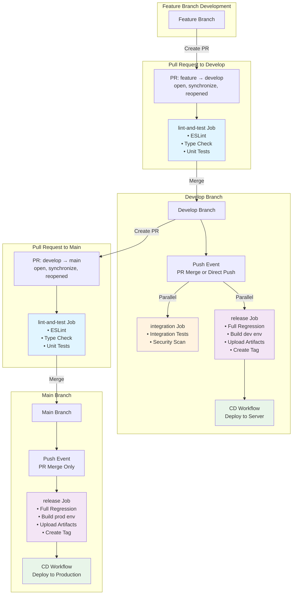
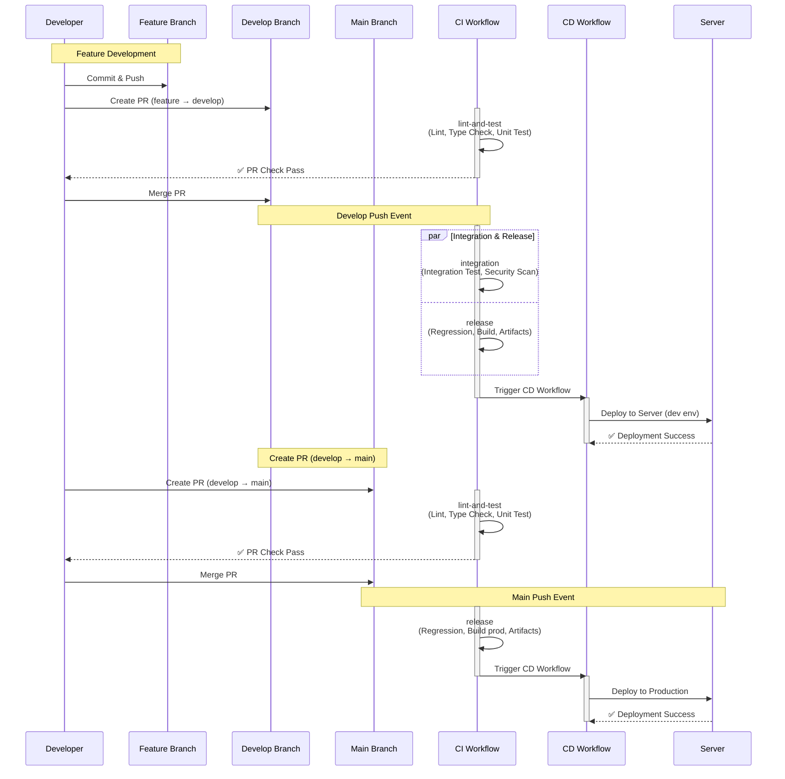
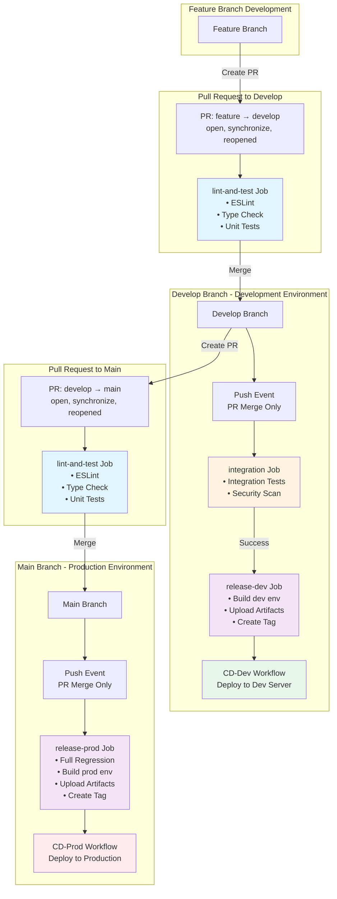
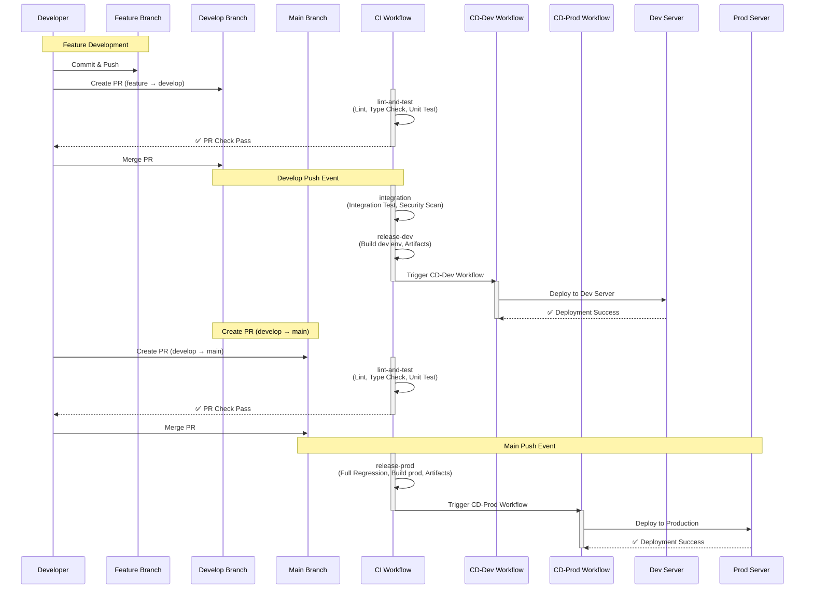
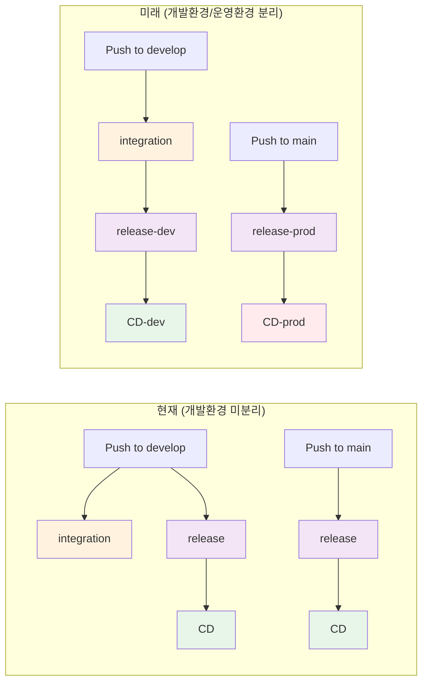
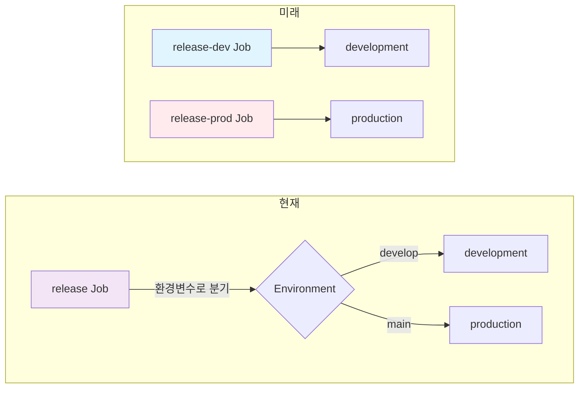
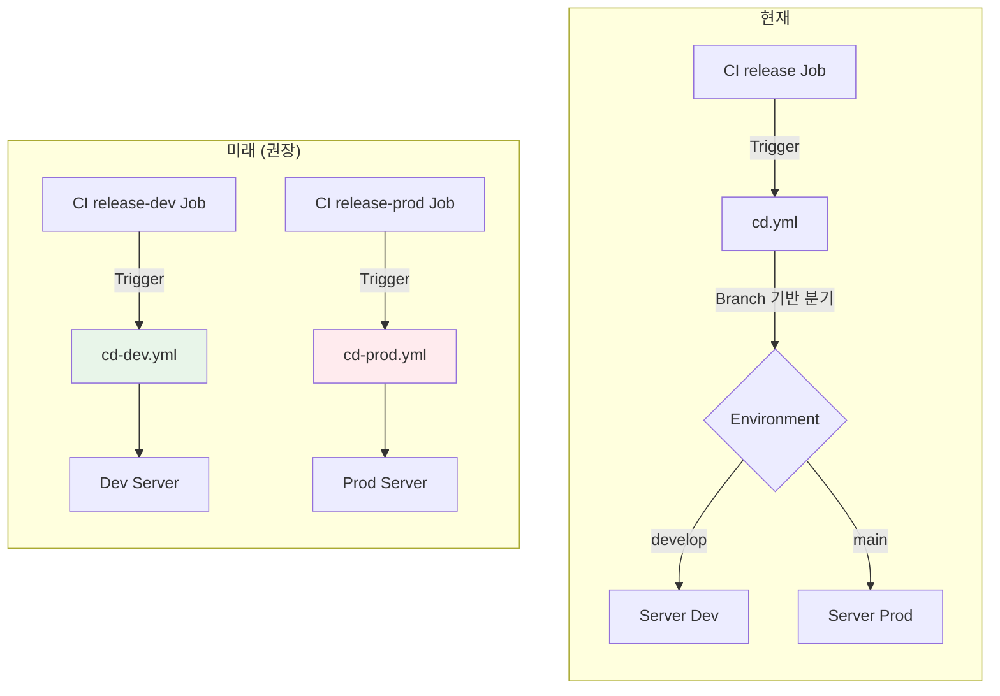

# CI/CD 워크플로우 다이어그램

> CI/CD 워크플로우를 Mermaid 다이어그램으로 시각화한 문서입니다.

## 목차

- [현재 시점 (개발환경 미분리)](#현재-시점-개발환경-미분리)
- [미래 시점 (개발환경/운영환경 분리)](#미래-시점-개발환경운영환경-분리)

---

## 현재 시점 (개발환경 미분리)

### 전체 워크플로우

### 브랜치별 상세 흐름

---

## 미래 시점 (개발환경/운영환경 분리)

### 전체 워크플로우

### 브랜치별 상세 흐름

### Job 의존성 관계

---

## Job별 실행 매트릭스

### 현재 시점

| 이벤트 | 브랜치 | lint-and-test | integration | release | CD |
|--------|--------|---------------|-------------|---------|-----|
| **PR 생성** | feature → develop | ✅ | ❌ | ❌ | ❌ |
| **Push** | develop | ❌ | ✅ | ✅ | ✅ |
| **PR 생성** | develop → main | ✅ | ❌ | ❌ | ❌ |
| **Push** | main | ❌ | ❌ | ✅ | ✅ |

### 미래 시점

| 이벤트 | 브랜치 | lint-and-test | integration | release-dev | release-prod | CD-dev | CD-prod |
|--------|--------|---------------|-------------|-------------|--------------|---------|----------|
| **PR 생성** | feature → develop | ✅ | ❌ | ❌ | ❌ | ❌ | ❌ |
| **Push** | develop | ❌ | ✅ | ✅ | ❌ | ✅ | ❌ |
| **PR 생성** | develop → main | ✅ | ❌ | ❌ | ❌ | ❌ | ❌ |
| **Push** | main | ❌ | ❌ | ❌ | ✅ | ❌ | ✅ |

---

## 주요 차이점

### Job 구조 비교

### CD Workflow 비교

---

## 관련 문서

- [CI/CD 워크플로우 개요](./cicd-workflow-overview.md)
- [CI/CD 상세 프로세스](./cicd-process.md)
- [배포 가이드](./bigbang-deployment.md)
- [CI 워크플로우](../../.github/workflows/ci.yml)
- [CD 워크플로우](../../.github/workflows/cd.yml)
